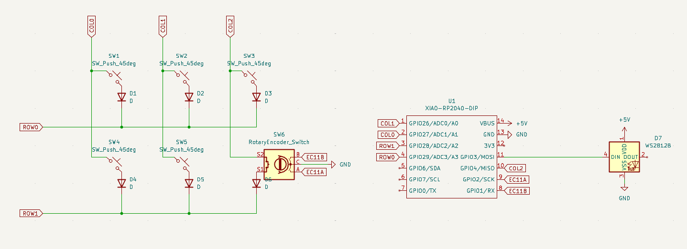
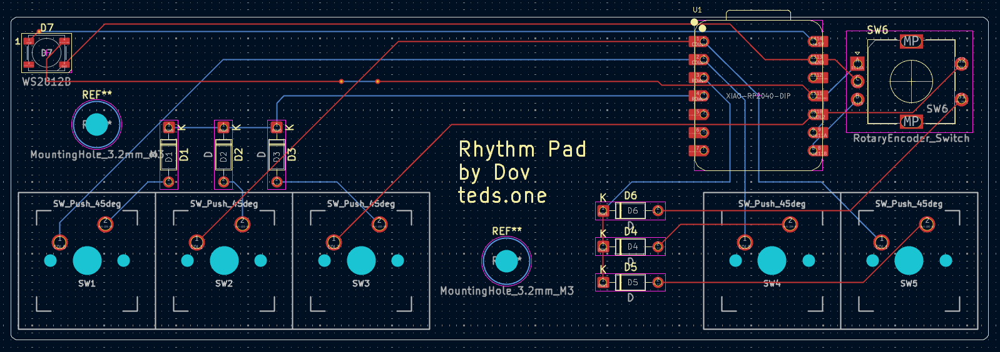
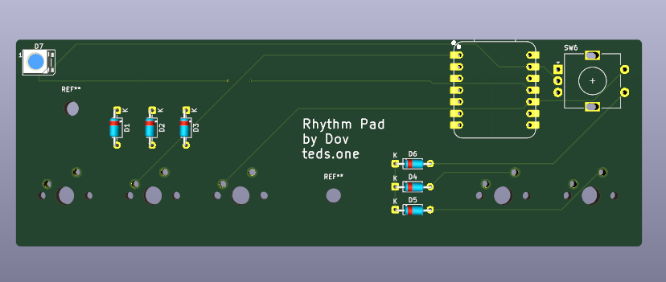
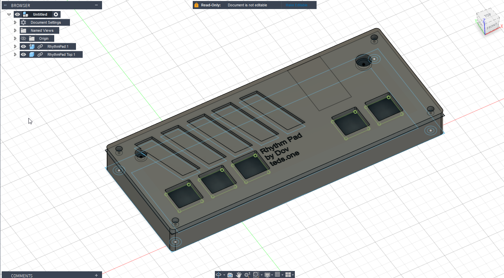
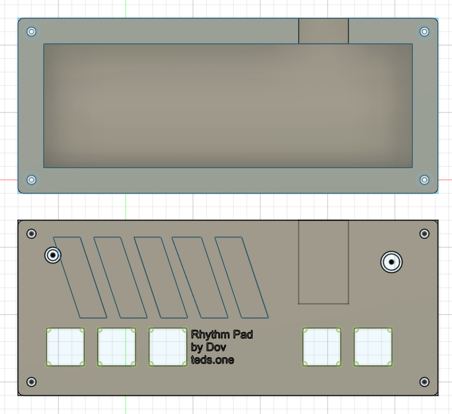

# RhythmPad

Have you played rhythm games and seen people use those cool keyboards with either just 4 keys, or 3 keys for games like osu!, osu!mania and Geometry Dash?  
The Rhythm Pad aims to be complatible with many rhythm games, such as the ones listed above.  
This should be compatible with VIA and should also be able to be used as a macropad.  

## Bill of Materials

Main Components:

- 5x Cherry MX switches
- 5x Blank DSA keycaps
- 1x EC11 Encoder
- 1x PCB
- 6x Through-hole 1N4148 Diodes
- 1x WS2812B LED / SK6812 MINI Led

Case Components:

- 4x M3 Heatset
- 4x M3x16 Bolt
- Top Case.step
- Bottom Case.step

Yes I am aware that this is larger than 200x200x100mm, but hopefully this can be an exception...  

Schematic            |  PCB         |   PCB (3d)
:-------------------------:|:-------------------------:|:-------------------------:|
    |    | 

Case (Assembled)            |  Case         
:-------------------------:|:-------------------------:|
    |  